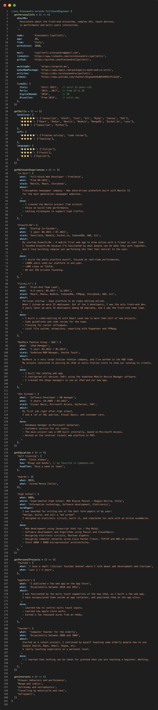

<h1 align="center">Hi everyone 👋 I'm Alessandro</h1>

<!--
[](https://git.io/typing-svg)
-->

[](https://skillicons.dev)


```js
class Alessandro extends FrontendEngineer {
  getPersonalInfo = () => ({
    aboutMe: `
      Passionate about the Front-end ecosystem, complex UIs, touch devices,
      js performance and multi users interaction.
    `,

    name:       'Alessandro Cipolletti',
    age:         32,
    from:       'Italy',
    worksSince:  2010,
    
    mail:     'cipolletti.alessandro@gmail.com',
    linkedin: 'https://www.linkedin.com/in/alessandro-cipolletti/',
    github:   'https://github.com/AlessandroCipolletti',
  
    workingOn:       'https://drawith.me',
    myOwnNpmPackage: 'https://www.npmjs.com/package/js-math-and-ui-utils',
    articles:        'https://dev.to/alessandrocipolletti',
    videos:          'https://www.youtube.com/channel/UCgeayDnKaNFmhM4InFLIwzQ',

    livedIn: {
      Italy:        'Until 2013',   // until 23 years old
      Paris:        '2013...2017',  // from 23 to 28
      DigitalNomad: '2018',         // 29
      Bruxelles:    'From 2019',    // until now
    },
  })

  getSkills = () => ({
    technical: {
      '⭐️⭐️⭐️⭐️⭐️': ['Javascript', 'Html5', 'Css3', 'Git', 'MySql', 'Canvas', 'SVG'],
      '⭐️⭐️⭐️⭐️':   ['React', 'Redux', 'NodeJs', 'MongoDb', 'Socket.Io', 'Less'],
      '⭐️⭐️⭐️':     ['Typescript', 'Python'],
    },
    soft: {
      '⭐️⭐️⭐️⭐️⭐️': ['Problem solving', 'Code review'],
      '⭐️⭐️⭐️⭐️':   ['Teaching'],
    },
    languages: {
      '⭐️⭐️⭐️⭐️⭐️': ['Italian'],
      '⭐️⭐️⭐️⭐️':   ['French'],
      '⭐️⭐️⭐️':     ['English'],
    },
  })
  
  getRelevantExperiences = () => ({
    'Drawith.Me': {
      what:  'Startup Co-founder',
      when:  'Last year: 07.2021 / 06.2022',
      stack: 'VanillaJs, NodeJs, Socket.io, AWS, Git',
      about: `
        My startup Drawith.Me - A mobile first web app to draw online with a friend in real time.
        I founded Drawith.Me because I'm fascinated by what people can do when they work together,
        and I love building complex yet performing UIs that feel natural to the user.
      `,
      done: `
        - I build the whole platform myself, focused on real-time performances.
        - +300K users used our platform in one year.
        - +30M views on TikTok.
        - We won 25K private founding.
      `,
    },

    'Pitchy.fr': {
      what:  'Front-End Team Lead',
      when:  '4 years: 05.2017 / 06.2021',
      stack: 'React, Redux, IndexedDb, FFMpeg, NodeJs, AWS, Git',
      about: `
        Parisian startup - Saas platform to do video editing online.
        When I joined we were 15 employees. Out of the 3 developers, I was the only front-end dev.
        4 years later we were 14 developers among 60 emploees, and I was the front-end team lead.
      `,
      done: `
        - I built a video-editing UI with React used now in more than half of new projects.
        - Code guidelines and code review for the team.
        - Training for junior colleagues.
        - Local file system, animations, exporting with Puppeteer and FFMpeg.
      `,
    },

    'MaxMara Fashion Group - R&D': {
      what:  'iPad Manager',
      when:  '1 year: 03.2012 / 05.2013',
      stack: 'Vodafone MDM Manager, Sencha Touch',
      about: `
        MaxMara is a very large Italian fashion company, and I've worked in the R&D team.
        My project consisted in putting an iPad in every Italian store to show our catalog to clients.
      `,
      done: `
        - I built the catalog web app.
        - I configured all devices (50+) using the Vodafone Mobile Device Manager software.
        - I trained the shops managers to use an iPad and our new app.
      `,
    },

    'Zen Sistemi': {
      what:  'Software Developer / DB manager',
      when:  '2 years: 10.2009 / 03.2012',
      stack: 'Visual Basic, Microsoft Access, SqlServer, PHP',
      about: `
        My first job right after high school.
        I did a lot of SQL queries, Visual Basic, and customer care.
      `,
      done: `
        - Database manager on Microsoft SqlServer.
        - Customers service for our users.
        - The main project was a CRM built internally, based on Microsoft Access.
        - Worked on the internal tickets web platform in PHP.
      `,
    },
  })

  getEducation = () => ({
    'Self training': {
      when: 'Since always',
      how: 'Blogs and books', // my favorite is tympanus.net
      howOften: 'Once a week at least',
    },

    'Awards': [{
      when: 2013,
      what: 'Passed the test to join Mensa Italia',
    }],

    'High School': {
      when: 2009,
      where: 'Experimental High School: BUS Blaise Pascal - Reggio Emilia, Italy',
      what: 'Information technology, Software development, Elettronics',
      termPaper: `
        I was awarded for making one of the best term papers of my year:
        "Design, build, and sell a led screen"
        I designed an elettronic circuit, built it, and simulated its sale with an online ecommerce.
      `,
      done: `
        - Web development using Javascript Html Css / Php MySql.
        - Software development and Algorithms using Pascal and VisualBasic.
        - Designing electronic circuits, Boolean algebra.
        - Designing computer networks using Cisco Packet Tracer, TCP/IP and 802.11 protocols.
        - Intel 8080 / 8088 microprocessor architectures.
      `,
    },
  })

  getPersonalProjects = () => ({
    'YouTube': {
      what: 'I have a small (italian) Youtube channel where I talk about web development and startups',
      when: 'Last 2 / 3 years',
    },

    'AppStore': {
      what:  'I published a few web app on the App Store',
      when:  'Occasionally between 2010 and 2013',
      about: `
        I was fascinated by the multi touch capability of the new iPad, so I built a few web app.
        I have encapsulated them inside an app container, and published them on the app store.
      `,
      done: `
        - Learned how to control multi touch inputs.
        - Learned how apple store works.
        - Earned a few thousand euros from an hobby.
      `,
    },

    'Teacher': {
      what:  'Computer Teacher for the elderly',
      when:  'Occasionally between 2008 and 2009',
      about: `
        Started as a school project, I continued by myself teaching some elderly people how to use
        Google Search, Maps, Gmail, Skype, etc.
        A really touching experience on a personal level.
      `,
      done: `
        - I learned that nothing can be taken for granted when you are teaching a beginner. Nothing.
      `,
    },
  })

  getInterests = () => ([
    'Browser behaviors and performance',
    'Manga and comics',
    'Astronomy and astrophysics',
    'Travelling by motorcycle and tent',
    'Volleyball',
  ])
}
```


<div align="center">
    
</div>

<!--
<div align="center">
    
</div>
<div align="center">
    
</div>
<div align="center">
    
</div>
<div align="center">
    
</div>
<div align="center">
    
</div>
<div align="center">
    
</div>
-->


<!--
<br /><br />
## Mt GitHub activity (public repo only)


[](https://github.com/AlessandroCipolletti/github-readme-stats)


<br /><br />
## Languages and libraries


## DB


# Tools


## Testing 


## Version control


## Packaging


## Server

-->

<!--
[](https://github.com/anuraghazra/github-readme-stats)

[](https://github.com/anuraghazra/github-readme-stats)
-->


